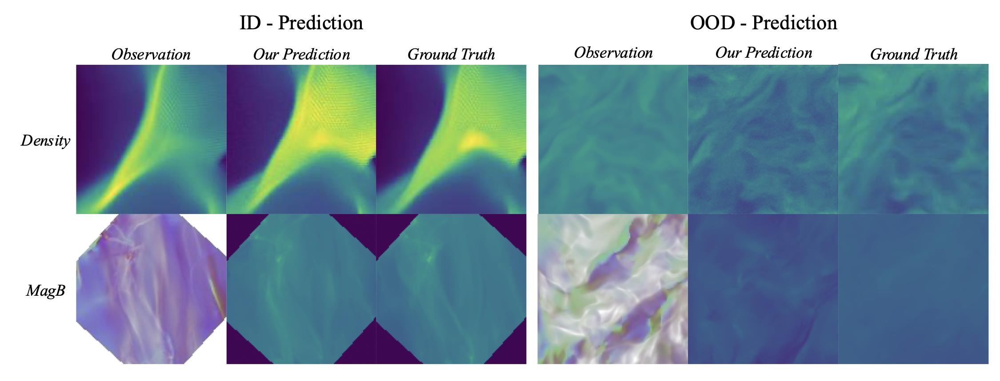
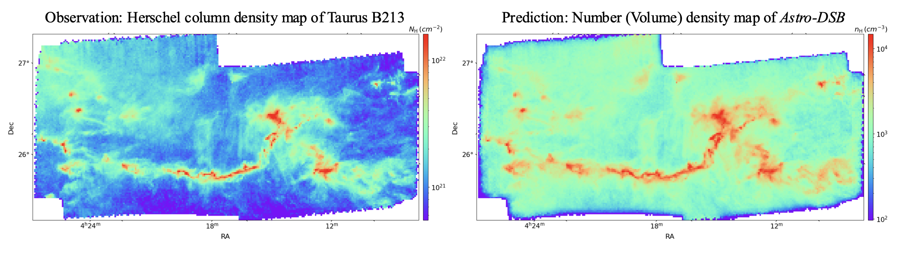

# Astrophysical Diffusion Schrödinger Bridge (Astro-DSB)

Ye Zhu (CS, Princeton), Duo Xu (CITA, University of Toronto), Zhiwei Deng (Google DeepMind), Jonathan C. Tan (Astronomy, UVA&Chalmers), Olga Russakovsky (CS, Princeton)

This is the official Pytorch implementation of the paper **[Dynamic Diffusion Schrödinger Bridge in Astrophysical Observational Inversions](https://www.arxiv.org/abs/2506.08065)**. 

Below we show the predicted results from our Astro-DSB model on **both synthetic simulations and real observations (the Taurus B213 data)** for volume density and magnetic field strength.

<p align="center">
    

 <p align="center">
    


## 1. Take-away

We introduce *Astro-DSB* tailored for astrophysical observational inverse predictions, featuring a variant of diffusion Schrödinger generative modeling techniques that learns the optimal transport between the observational distribution and the true physical states. 

Our key contributions can be summarized below:

- From the astrophysical perspective, our proposed paired DSB method improves **interpretability, learning efficiency, and prediction performance** over conventional astrostatistical and other machine learning methods.

- From the generative modeling perspective, we show that probabilistic generative modeling yields improvements over discriminative pixel-to-pixel modeling in Out-Of-Distribution (OOD) testing cases of physical simulations **with unseen initial conditions and different dominant physical processes**.

Our study expands research into diffusion models beyond the traditional visual synthesis application and provides evidence of **the models’ learning abilities beyond pure data statistics**, paving a path for future physics-aware generative models that can align dynamics between machine learning and real (astro)physical systems.

## 2. Environment setup

You can follow the instructions below to setup the running environment. After setting 

```
conda env create --file requirements.yaml python=3
conda activate astrodsb
```

## 3. Dataset preparation

In our work, we train the proposed Astro-DSB model with density and magnetic field data synthesized from the GMC simulations. To work on your customized dataset, you may pro-process the dataset following the format in the ```dataset``` folder.

## 4. Model training and inference

You may use the following commands to train and test the Astro-DSB model, with 'expid' to be the specified experiment ID and 'N' to be the number of GPUs per node.

```
python train.py --name 'expid' --n-gpu-per-node $N
```

```
python eval.py --name 'expid' 
```

## 5. Citation

If you find our work interesting and useful, please consider citing it.
```
@article{zhu2025dynamic,
  title={Dynamic Diffusion Schrödinger Bridge in Astrophysical Observational Inversions},
  author={Zhu, Ye and Xu, Duo and Deng, Zhiwei and Tan, Jonathon C and Russakovsky, Olga},
  journal={arXiv preprint arXiv:2506.08065},
  year={2025}
}
```

## 6. Acknowledgements

We would like to thank the authors of previous related projects for generously sharing their code, especially the [IS2B](https://github.com/NVlabs/I2SB), from which our code is adapted.
